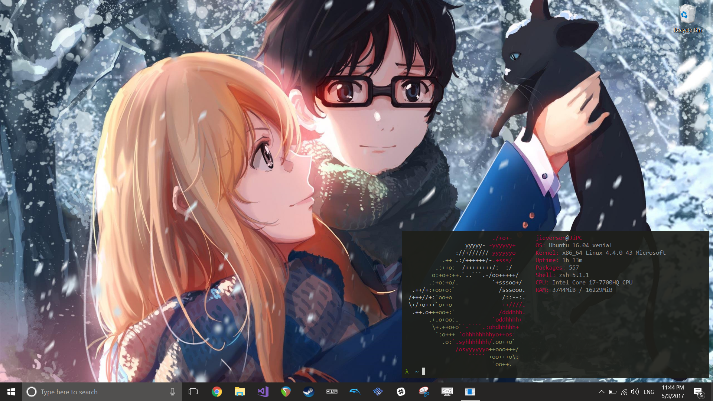
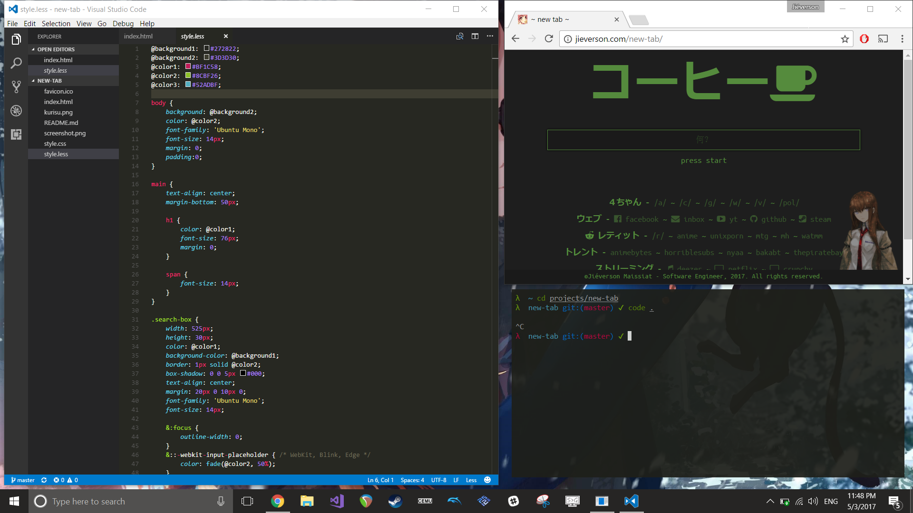

# dotfiles-win
My ~~Bash~~ Zsh on Ubuntu on Windows configuration files. (See my arch linux configuration files [here](https://github.com/jieverson/dotfiles))

> Windows 10 can now officially run native Ubuntu subsystem. Its default settings comes with Bash, but it's possible to install different shells (my settings are using Zsh). If you need to learn how to install Ubuntu on Windows, take a look at this [Microsoft Guide](https://msdn.microsoft.com/en-us/commandline/wsl/install_guide).

### usage
Just run `install.sh` to install zsh (including oh-my-zsh and other important stuff) and symlink all dotfiles.

```
$ git clone https://github.com/jieverson/dotfiles-win.git ~/.dotfiles
$ ~/.dotfiles/install.sh
```

To keep up to date, you can just `pull` this repo, and re-run `install.sh`.

### screenshots
<p align="center">
  
</p>
<p align="center">
  
</p>
<p align="center">
  
</p>

> **Windows Wallpaper for 4k resolution:** [./wallpaper.jpg](https://rawgit.com/jieverson/dotfiles-win/master/wallpaper.jpg)

### About My Terminal Emulator

As you can see at screenshots, I'm not using Windows default console emulator.
I'm using [Cmder](http://cmder.net/) ([GitHub Repo](https://github.com/cmderdev/cmder)).
It's a customizable Windows Console Emulator and my settings can be found at [./cmder/config/ConEmu.xml](https://rawgit.com/jieverson/dotfiles-win/master/cmder/config/ConEmu.xml).
